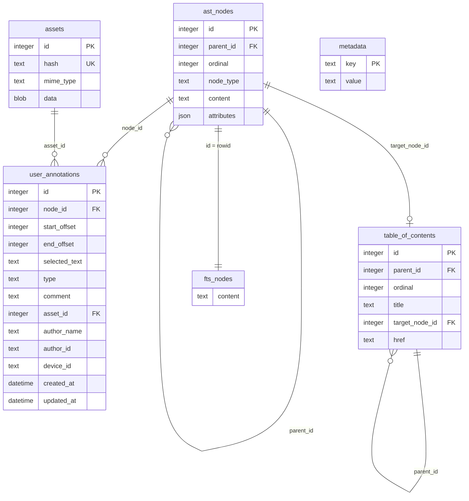

# weland

*Named for Wēland, the smith-god of Germanic legend — imprisoned for his craft, who forged himself wings from what was left and flew free.*

**An archival-grade, annotation-native ebook format — and the reader built to prove it.**

---


## Why weland

EPUB simulates paper — pages, spines, reflowable text. What it never simulated is the mark a reader leaves behind: a highlight, a margin note, a voice memo pinned to the line that mattered. Every app bolts that on as a private sidecar, tied to one account and one device, gone the moment you switch readers.

weland fixes this at the format level, not the app level. Every book compiles to one self-contained SQLite file — the same container format the Library of Congress already trusts for long-term preservation. Text is a structured, queryable AST, not flowed HTML. Annotations are first-class rows sitting next to the text they anchor to, addressed by Unicode offset so they survive reflow, font changes, even a structural revision of the book itself. A library becomes queryable — full-text search, cross-references — with no app quietly maintaining a shadow database to fake what the format should do natively.

**This isn't a pitch to replace EPUB as an authoring format.** Publishing happens in EPUB — that's where the tools and the whole industry already live, and weland fully supports converting from it. What weland replaces is what happens *after* a book is finished: the artifact you actually read, own, and mark up. `weland compile` turns an EPUB into a `.wld` the same way a compiler turns source into a binary — you don't hand-author the output, you author the source and let the build step add the value.

## Why weland reader

`reader/` is the reference client — proof the format isn't just a spec on paper. Open a `.wld`, or import an EPUB directly, and get a full desktop reading app: highlights, text notes, recorded voice notes, a searchable multi-book library — none of it locked behind an account you don't control. Every annotation is a row in a file sitting on your disk; back it up, move it, hand it to someone.

It's a Tauri v2 app with a plain HTML/JS frontend — no bundler, no npm toolchain — and it's built sandboxed-by-default with explicit export on demand, specifically so it can ship as a real Flatpak on Flathub and on Steam, not just run from source.

## Quickstart

```sh
cargo install --path .

weland compile book.epub              # -> book.wld
weland inspect book.wld               # metadata, AST breakdown, assets, schema
weland search book.wld "a phrase"     # FTS5 full-text search
weland extract book.wld --out-dir ./assets
weland export book.wld --format markdown   # or json / text
```

```sh
cd reader/src-tauri
cargo run
```

## The spec

A `.wld` file is a plain SQLite database — six tables, no proprietary container, readable by anything that speaks SQL:



- **`metadata`** — flat key/value pairs: `title`, `author`, `language`, `description`, `identifier`, `publisher`, `cover_asset_id`.
- **`ast_nodes`** — the book itself, as a tree (`parent_id` self-reference) ordered by `ordinal`. `node_type` is one of `heading`, `paragraph`, `blockquote`, `list`, `table`, `image`, `thematic_break`, `footnote`. `attributes` is free-form JSON per type — headings carry `level`, images carry `asset_id`/`alt`/`caption`, tables carry `rows`, and text-bearing types carry `spans`: an array of `{ start, end, type }` marking inline formatting over `content` — `bold`, `italic`, `code`, `strikethrough`, `underline`, `highlight`, or `link` (with an `href`).
- **`assets`** — binary blobs (cover art, embedded images, recorded voice notes), content-hash deduped so the same image never gets stored twice.
- **`user_annotations`** — highlights, text notes, and voice notes, anchored to a node via `start_offset`/`end_offset`: **Unicode codepoint offsets into that node's `content`**, the same coordinate space `spans` uses — so an annotation survives font changes and reflow, because it was never tied to pixels in the first place. `type` is `highlight`, `text_note`, or `voice_note` today; `ink_sketch` is reserved in the schema for future drawing support. `asset_id` links a voice note to its audio blob.
- **`table_of_contents`** — a tree (again via `parent_id`) independent of the AST's own nesting, each entry optionally pointing at the `ast_nodes` row it should jump to.
- **`fts_nodes`** — an FTS5 index mirroring `ast_nodes.content`, powering `weland search` and the reader's search bar.

## Who this is for

- **Indie ereader devs** who'd rather get structure, search, and annotation storage for free than reimplement all three, badly, on top of styled HTML.
- **DRM-free publishers and small presses** who want their books to actually belong to their readers.
- **Archivists and librarians** who want a format built on a container already trusted for long-term preservation.
- **Researchers, language learners, book clubs, serious annotators** — anyone for whom a book is a conversation, not a one-way read.

## What this is not

Not a pitch to dethrone EPUB's install base, and not an authoring format — write in EPUB, read and own in weland. Built because the problem is real, the fix is possible, and it's worth building well: a format made the way a craftsperson builds a tool meant to outlast them.

---

*A reference compiler (EPUB → `.wld`) and a reference reader client live in this repository. The specification is a work in progress — contributions welcome.*
