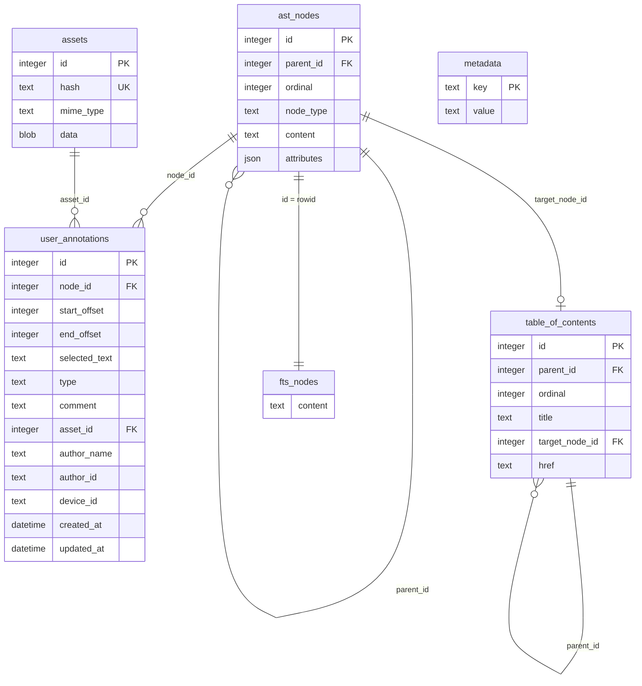

# weland

*Wēland, master smith of Germanic legend — imprisoned by a king who wanted his craft kept for himself, and hamstrung so he couldn't leave. He forged himself wings from what was left, and flew free.*

**An archival-grade, annotation-native ebook format.**

---


## The problem

A paper book carries the mark of every hand that worked it over — an underlined passage, a name in the front cover, a margin note a kid finds years later and reads twice: once for the words, once for the hand that wrote them. That mark *is* the book.

EPUB never made room for that. It simulates paper — pages, spines, reflowable text — but the annotations you leave today live in a proprietary silo, tied to one app, one account, one device. Sealed shut the moment you write them. The format never asked what happens to the work a reader puts into a book. weland is the answer.

## The idea

Every book compiles to a single self-contained SQLite file — no external deps, the same container format the Library of Congress already trusts for long-term digital preservation. Text isn't flowed HTML, it's a structured, queryable AST. Annotations — highlights, notes, a reader's own voice pinned to the exact words that moved them — aren't a sidecar an app maintains behind your back. They're first-class rows next to the text they anchor to, precise enough to survive reflow, font changes, even a structural revision of the book itself.

That one choice changes what a book can be. A library becomes queryable — full-text search, cross-references, structure — with no app secretly building its own shadow database just to do what the format should've done. And a book becomes something you can actually hand down: a parent's marginalia, still anchored to the right words, in the copy their kid inherits.

The name isn't decorative. Weland forged his own way out of a cage built to keep his craft captive. A book compiled to `.wld` carries the marks of everyone who ever worked on it — unlocked, and passed on.

## Quickstart

```sh
cargo install --path .

weland compile book.epub              # -> book.wld
weland inspect book.wld               # metadata, AST breakdown, assets, schema
weland search book.wld "a phrase"     # FTS5 full-text search
weland extract book.wld --out-dir ./assets
weland export book.wld --format markdown   # or json / text
```

A reference reader client — open, browse, search, and annotate a `.wld` with highlights, text notes, and recorded voice notes — lives in `reader/`. It's a Tauri desktop app with no JS bundler:

```sh
cd reader/src-tauri
cargo run
```

## The spec

A `.wld` file is a plain SQLite database — six tables, no proprietary container, readable by anything that speaks SQL:



- **`metadata`** — flat key/value pairs: `title`, `author`, `language`, `description`, `identifier`, `publisher`, `cover_asset_id`.
- **`ast_nodes`** — the book itself, as a tree (`parent_id` self-reference) ordered by `ordinal`. `node_type` is one of `heading`, `paragraph`, `blockquote`, `list`, `table`, `image`, `thematic_break`, `footnote`. `attributes` is free-form JSON per type — headings carry `level`, images carry `asset_id`/`alt`/`caption`, tables carry `rows`, and text-bearing types carry `spans`: an array of `{ start, end, type }` marking inline formatting over `content` — `bold`, `italic`, `code`, `strikethrough`, `underline`, `highlight`, or `link` (with an `href`).
- **`assets`** — binary blobs (cover art, embedded images, recorded voice notes), content-hash deduped so the same image never gets stored twice.
- **`user_annotations`** — highlights, text notes, and voice notes, anchored to a node via `start_offset`/`end_offset`: **Unicode codepoint offsets into that node's `content`**, the same coordinate space `spans` uses — so an annotation survives font changes and reflow, because it was never tied to pixels in the first place. `type` is `highlight`, `text_note`, or `voice_note` today; `ink_sketch` is reserved in the schema for future drawing support. `asset_id` links a voice note to its audio blob.
- **`table_of_contents`** — a tree (again via `parent_id`) independent of the AST's own nesting, each entry optionally pointing at the `ast_nodes` row it should jump to.
- **`fts_nodes`** — an FTS5 index mirroring `ast_nodes.content`, powering `weland search` and the reader's search bar.

## Who this is for

Not aimed at dethroning EPUB by force of adoption — built for the people EPUB was never built for:

- **Indie ereader devs** who'd rather get structure, search, and annotation storage for free than reimplement all three, badly, on top of styled HTML.
- **DRM-free publishers and small presses** who want their books to actually belong to their readers.
- **Archivists and librarians** who want a format built on a container already trusted for long-term preservation.
- **Researchers, language learners, book clubs, serious annotators** — anyone for whom a book is a conversation, not a one-way read.
- **Anyone who's ever wanted to hand a book to someone they love, thoughts and all.**

## What this is not

Not commercially driven, not chasing EPUB's install base. It exists because the problem is real, the fix is possible, and it's worth building well — a format designed the way a craftsperson builds a tool meant to outlast them.

---

*A reference compiler (EPUB → `.wld`) and a reference reader client live in this repository. The specification is a work in progress — contributions welcome.*
