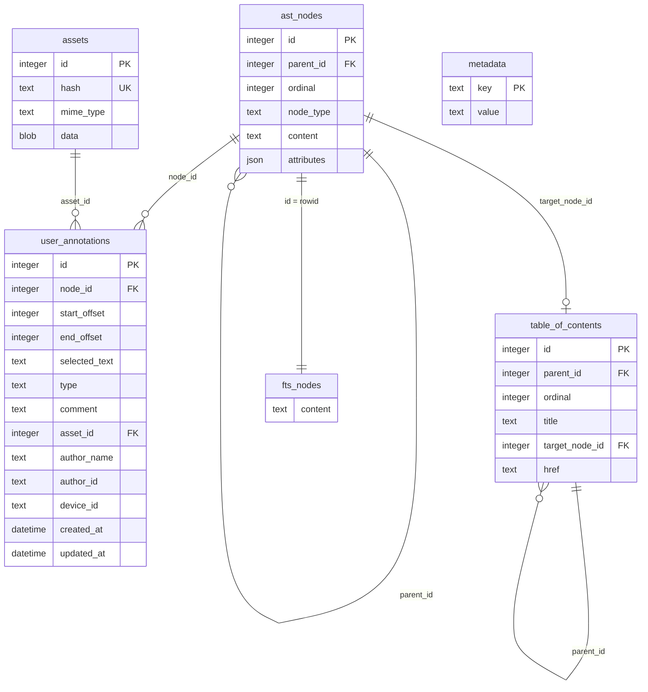

# weland

*Wēland, smith-god of Germanic legend, was hamstrung and caged on an island by a king who coveted his craft. He forged himself wings from what was left of it, and flew.*


**Weland Reader is a native GTK4 ebook app built on a format that refuses to cage your annotations the way a king once caged its namesake.** Highlights, notes, and voice memos live inside the book file itself — no account, no sidecar, no app-specific database. Hand someone the file and you've handed them everything.

## Weland Reader

Open an EPUB or a `.wld` and get a real desktop reading app, not a wrapped webpage:

- Highlights, text notes, and recorded voice notes, anchored straight into the text
- Full-text search across a book — and across your whole library at once
- A library-wide annotations browser: search and export every highlight and note you've ever made, in one place
- Dictionary lookup with a personal vocab builder, exportable to Markdown/JSON
- LAN sharing — find other Weland instances on your network and pull a book someone's offered, no cloud required
- Sort/filter library view, per-book metadata editing, a pan/zoom image viewer, remappable keyboard shortcuts, a real preferences dialog

No webview, anywhere. Pure GTK4/libadwaita, native Pango rendering — a smaller attack surface for files of uncertain provenance, and a lighter footprint that runs as well on a Steam Deck as a desktop.

```sh
cd gtk-reader
cargo run -- path/to/book.wld   # or with no path, to open the library
```

Voice-note playback needs `gst-plugins-good` at runtime (`GtkMediaFile` is GStreamer-backed). Most systems already have it as a transitive dependency of a browser; if not, `sudo pacman -S gst-plugins-good` on Arch, or your distro's equivalent.

Flatpak packaging and a Steam Deck-specific pass are what's left before this is something you install instead of something you build.

## The compiler

`weland compile book.epub` turns an EPUB into a `.wld` the way a compiler turns source into a binary: a self-contained SQLite file, structured AST instead of flowed HTML, annotations as first-class rows instead of a bolted-on sidecar, full-text search built in from the start. Publishing still happens in EPUB — weland is what the book becomes once it's meant to be read, owned, and marked up.

```sh
cargo install --path .

weland compile book.epub                   # -> book.wld
weland inspect book.wld                    # metadata, AST breakdown, assets
weland search book.wld "a phrase"          # FTS5 full-text search
weland extract book.wld --out-dir ./assets
weland export book.wld --format markdown   # or json / text
```

## Who this is for

Indie ereader devs who want structure, search, and annotation storage for free instead of reimplementing all three on top of styled HTML. DRM-free publishers who want a reader's books to actually belong to them. Archivists building on a container already trusted for long-term preservation. Anyone for whom a book is a conversation, not a one-way read.

Not a pitch to replace EPUB as an authoring format — write in EPUB, read and own in weland.

## The format

A `.wld` file is plain SQLite, six tables, no proprietary container — readable by anything that speaks SQL.



- **`metadata`** — flat key/value: title, author, language, cover, and friends.
- **`ast_nodes`** — the book as a tree, ordered by `ordinal`. Text-bearing nodes carry `spans` in `attributes`: inline formatting (`bold`, `italic`, `link`, …) as `{ start, end, type }` ranges over `content`.
- **`assets`** — cover art, images, voice-note audio, content-hash deduped.
- **`user_annotations`** — highlights, notes, voice notes, anchored by **Unicode codepoint offset** into a node's `content` — the same coordinate space `spans` uses, so an annotation survives font changes and reflow because it was never tied to pixels to begin with.
- **`table_of_contents`** — its own tree, independent of the AST's nesting, each entry optionally pointing at the node it jumps to.
- **`fts_nodes`** — an FTS5 mirror of every node's text, powering both `weland search` and the reader's own search bar.

---

*Built the way a smith builds a tool meant to outlast the hand that forged it.*
